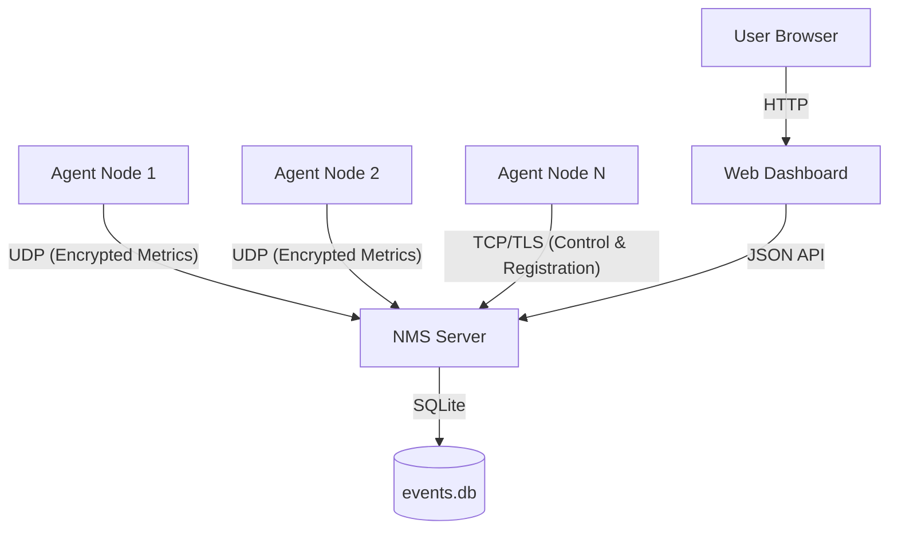

# Network Monitoring System (NMS)

A high-performance, distributed network monitoring system built from scratch using raw UDP and TCP sockets. Designed for reliability, security, and real-time visibility into distributed system health.

## Architecture Overview

NMS uses a hybrid protocol approach to balance high-frequency telemetry with reliable control signaling:

- **Telemetry Channel (UDP + Fernet)**: Agent nodes stream metrics (CPU, Memory, RTT) using encrypted UDP datagrams. A custom ACK + Retransmit layer ensures reliability over the unreliable UDP transport.
- **Control Channel (TCP + mTLS 1.2)**: A secure channel for node registration, key rotation, and batched performance reports.
- **Web Dashboard (Flask + Chart.js)**: A real-time visualization layer that aggregates data from a thread-safe SQLite backend.



## Key Features

- **Dual-Layer Security**:
  - **Fernet (AES-128-CBC)**: Application-layer encryption for all UDP telemetry.
  - **Mutual TLS (mTLS)**: Certificate-based authentication for the TCP control channel.
- **Reliable UDP**: Custom reliability protocol featuring sequence numbering, acknowledgment (ACK), and automatic retransmission (up to 3 retries).
- **Real-time Analytics**: Live dashboard showcasing P99 RTT, packet loss percentage, and throughput metrics.
- **Node Watchdog**: Automatic detection of "Down" nodes via heartbeat monitoring.
- **Stress Test Suite**: Comprehensive benchmarking tool to evaluate system performance under heavy concurrent load (50+ clients).

## Project Structure

```
.
├── certs/                 # SSL/TLS certificates and Fernet keys
├── client/                # Agent implementation (metrics collector)
│   └── client.py          # Main node logic
├── scripts/               # Administrative utilities
│   └── setup_certs.py     # mTLS certificate generation script
├── server/                # Core server logic
│   ├── config.py          # Central configuration & thresholds
│   ├── database.py        # SQLite persistence layer
│   ├── state.py           # Thread-safe in-memory metrics
│   └── udp_server.py     # Main server entry point
├── tests/                 # Quality assurance
│   └── stress_test.py     # High-concurrency benchmark
├── web/                   # Visualization layer
│   ├── app.py             # Flask application & REST API
│   └── templates/         # HTML/JS dashboard
└── requirements.txt       # Dependencies (cryptography, flask, psutil)
```

## Setup & Installation

### Prerequisites

- Python 3.8 or higher
- pip package manager

### 1. Environment Setup

Install the required dependencies:

```bash
pip install -r requirements.txt
```

### 2. Security Configuration (mTLS)

First, generate the Certificate Authority and signed certificates for the server and clients:

```bash
python scripts/setup_certs.py
```

This also generates the shared `fernet.key` for UDP encryption.

### 3. Launch the Server

Start the NMS server:

```bash
cd server && python udp_server.py
```

The server will listen on:
- UDP port 9000 for telemetry
- TCP port 9001 for control (mTLS)

### 4. Start the Web Dashboard

In a separate terminal:

```bash
cd web && python app.py
```

Access the dashboard at: `http://localhost:5000`

### 5. Deploy Agents

Start one or more client agents. Each agent will automatically register with the server and begin sending metrics.

```bash
# Start a single agent
cd client && python client.py

# Start multiple agents in separate terminals to simulate a distributed environment
```

## Usage

### Monitoring Metrics

Each agent collects and reports the following metrics every 5 seconds:

- **HEARTBEAT**: Uptime in seconds
- **CPU_USAGE**: CPU utilization percentage
- **MEMORY_USAGE**: RAM utilization percentage
- **NETWORK_LATENCY**: TCP probe RTT to 8.8.8.8:53 in milliseconds
- **NETWORK_JITTER**: Variance in recent latency measurements
- **DISK_USAGE**: Primary disk utilization percentage
- **BANDWIDTH_USAGE**: Network I/O rate in bytes per second
- **TCP_CONNECTIONS**: Number of established TCP connections
- **PACKET_LOSS**: Percentage of lost UDP packets

### Alert Events

The following alerts are triggered when thresholds are exceeded (with cooldown periods):

- **CPU_THRESHOLD_EXCEEDED**: CPU usage > 75%
- **MEMORY_THRESHOLD_EXCEEDED**: Memory usage > 80%
- **LATENCY_HIGH**: Network latency > 100ms
- **NETWORK_FAILURE**: Unable to reach external host
- **DISK_USAGE_HIGH**: Disk usage > 90%
- **BANDWIDTH_SPIKE**: Bandwidth usage > 10 MB/s
- **NODE_DOWN**: Node heartbeat timeout (30 seconds)

### Dashboard Features

The web dashboard provides:

- **Real-time Statistics**: Active nodes, events per second, RTT metrics, packet loss
- **Node Status Overview**: Current status of all connected agents
- **Performance Charts**: Historical trends for RTT and throughput
- **Event Log**: Filterable log of all system events with severity levels

## Configuration

Key configuration parameters are located in `server/config.py`:

- `UDP_PORT`: 9000 (telemetry port)
- `TCP_PORT`: 9001 (control port)
- `WEB_PORT`: 5000 (dashboard port)
- `ACK_TIMEOUT`: 2.0 seconds (UDP acknowledgment timeout)
- `MAX_RETRIES`: 3 (UDP retransmission attempts)
- `NODE_TIMEOUT`: 30 seconds (heartbeat expiry)
- `CPU_THRESHOLD`: 75% (alert threshold)
- `MEMORY_THRESHOLD`: 80% (alert threshold)
- `LATENCY_THRESHOLD`: 100ms (alert threshold)

## Performance & Stress Testing

Evaluate the system's robustness using the included stress test:

### Baseline Test (1 client, 20 packets)

```bash
python tests/stress_test.py --clients 1 --packets 20
```

### Stress Test (50 clients, 100 packets each)

```bash
python tests/stress_test.py --clients 50 --packets 100
```

### Burst Mode (Simulated Packet Storm)

```bash
python tests/stress_test.py --clients 50 --packets 100 --burst
```

### Typical Performance Results

| Metric | Baseline | Stress (50 Clients) |
|--------|----------|---------------------|
| Avg RTT | < 1ms | ~2-5ms |
| P99 Latency | < 2ms | < 10ms |
| Packet Loss | 0% | < 0.1% |

## Compliance with Computer Networks Requirements

| Requirement | Implementation |
|-------------|----------------|
| Raw Sockets | Uses `socket.socket(AF_INET, SOCK_DGRAM/SOCK_STREAM)` exclusively |
| Multi-threading | Server uses thread-per-packet and background worker threads |
| Security | Implements both Symmetric (Fernet) and Asymmetric (mTLS) encryption |
| Reliability | Custom ACK/Retransmit mechanism on top of UDP |
| Error Handling | Robust handling of dropped packets, sequence gaps, and client timeouts |
| Real-time Data | Dashboard polls API every 3 seconds for live updates |

## Troubleshooting

### Common Issues

1. **Certificate Errors**: Ensure `scripts/setup_certs.py` has been run and certificates are in the `certs/` directory.

2. **Port Conflicts**: Verify that ports 9000, 9001, and 5000 are available.

3. **Firewall Issues**: Ensure UDP/TCP traffic is allowed on the specified ports.

4. **Python Dependencies**: Install all requirements with `pip install -r requirements.txt`.


## Development

### Adding New Metrics

1. Define the metric collection logic in `client/client.py`
2. Add the event type to `EVENT_TYPES` in `server/config.py`
3. Update the dashboard filters in `web/templates/index.html` if needed

### Extending the Protocol

- UDP telemetry: Modify payload format in `client.py` and parsing in `udp_server.py`
- TCP control: Add new command handlers in `udp_server.py`

### Database Schema

The SQLite database (`events.db`) contains three tables:
- `events`: All telemetry events
- `ack_log`: RTT measurements
- `perf_stats`: Aggregated performance snapshots

## License

This project is licensed under the MIT License. See the LICENSE file for details.
