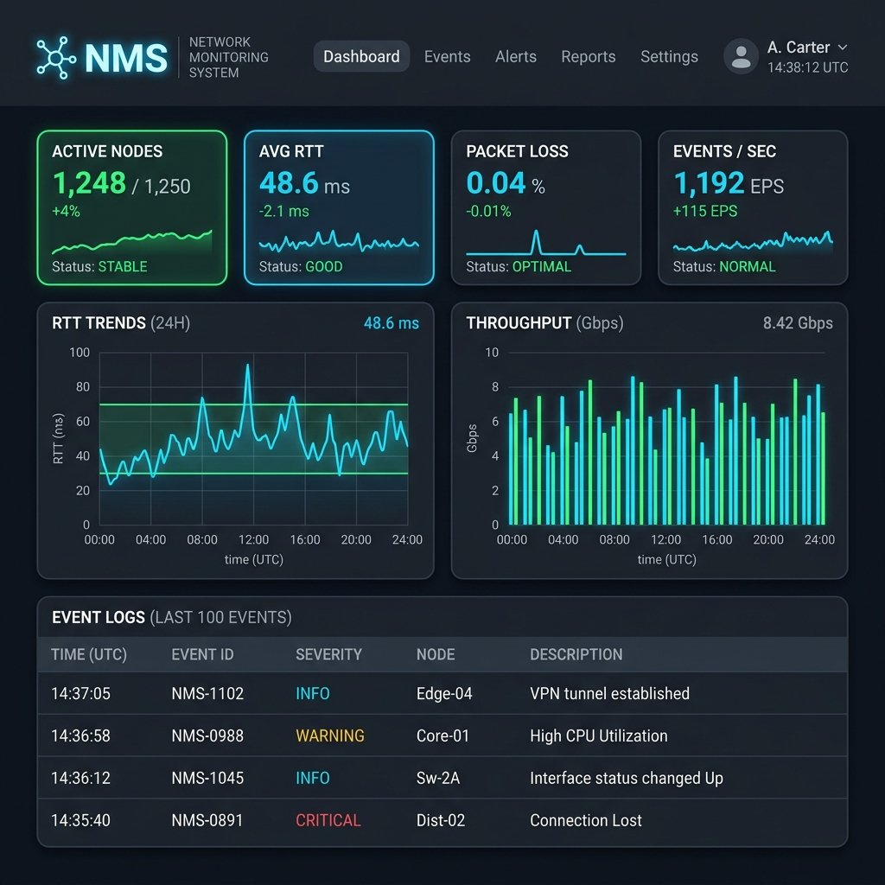
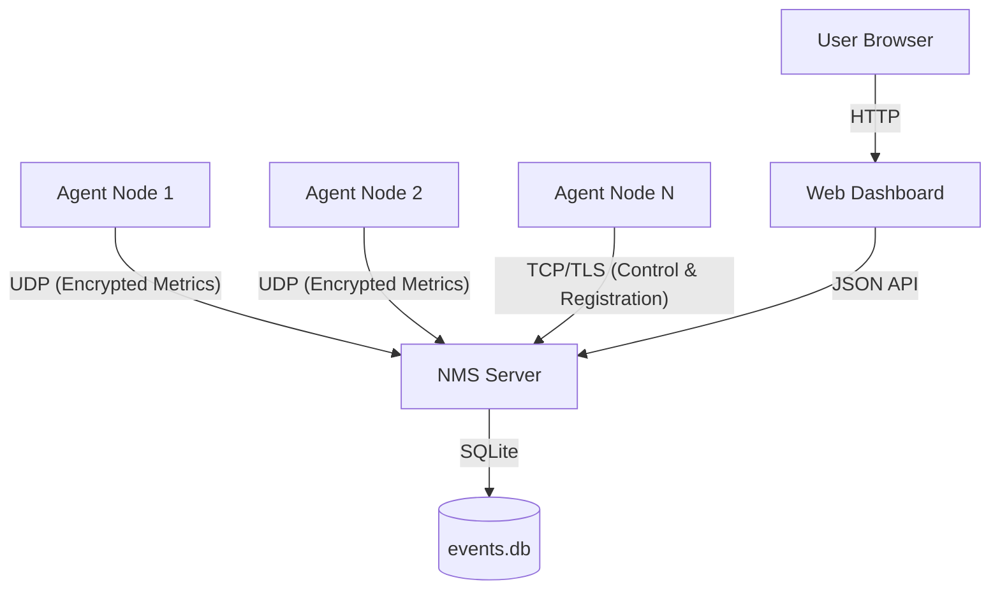

# 📡 Network Event Monitoring System (NMS)

[](https://opensource.org/licenses/MIT)
[](https://www.python.org/downloads/)
[]()

A high-performance, distributed network monitoring system built from scratch using raw **UDP** and **TCP** sockets. Designed for reliability, security, and real-time visibility into distributed system health.



---

## 🏗️ Architecture Overview

NMS uses a hybrid protocol approach to balance high-frequency telemetry with reliable control signaling:

- **Telemetry Channel (UDP + Fernet)**: Agent nodes stream metrics (CPU, Memory, RTT) using encrypted UDP datagrams. A custom **ACK + Retransmit** layer ensures reliability over the unreliable UDP transport.
- **Control Channel (TCP + mTLS 1.2)**: A secure channel for node registration, key rotation, and batched performance reports.
- **Web Dashboard (Flask + Chart.js)**: A real-time visualization layer that aggregates data from a thread-safe SQLite backend.



---

## 🚀 Key Features

- **🛡️ Dual-Layer Security**: 
  - **Fernet (AES-128-CBC)**: Application-layer encryption for all UDP telemetry.
  - **Mutual TLS (mTLS)**: Certificate-based authentication for the TCP control channel.
- **⚡ Reliable UDP**: Custom reliability protocol featuring sequence numbering, acknowledgment (ACK), and automatic retransmission (up to 3 retries).
- **📊 Real-time Analytics**: Live dashboard showcasing P99 RTT, packet loss percentage, and throughput metrics.
- **🐕 Node Watchdog**: Automatic detection of "Down" nodes via heartbeat monitoring.
- **🛠️ Stress Test Suite**: Comprehensive benchmarking tool to evaluate system performance under heavy concurrent load (50+ clients).

---

## 📂 Project Structure

```text
.
├── certs/                 # SSL/TLS certificates and Fernet keys
├── client/                # Agent implementation (metrics collector)
│   └── client.py          # Main node logic
├── scripts/               # Administrative utilities
│   └── setup_certs.py     # mTLS certificate generation script
├── server/                # Core server logic
│   ├── config.py          # Central configuration & thresholds
│   ├── database.py        # SQLite persistence layer
│   ├── state.py           # Thread-safe in-memory metrics
│   └── udp_server.py      # Main server entry point
├── tests/                 # Quality assurance
│   └── stress_test.py     # High-concurrency benchmark
├── web/                   # Visualization layer
│   ├── app.py             # Flask application & REST API
│   └── templates/         # HTML/JS dashboard
└── requirements.txt       # Dependencies (cryptography, flask, psutil)
```

---

## 🛠️ Setup & Installation

### 1. Environment Setup
```bash
pip install -r requirements.txt
```

### 2. Security Configuration (mTLS)
First, generate the Certificate Authority and signed certificates for the server and clients:
```bash
python scripts/setup_certs.py
```
*Note: This also generates the shared `fernet.key` for UDP encryption.*

### 3. Launch the Server
```bash
cd server && python udp_server.py
```

### 4. Start the Dashboard
```bash
cd web && python app.py
```
View the dashboard at: `http://localhost:5000`

### 5. Deploy Agents
```bash
# Start a single agent
cd client && python client.py

# Start multiple agents in separate terminals to see concurrency in action
```

---

## 📈 Performance & Stress Testing

Evaluate the system's robustness using the included stress test:

- **Baseline Test** (1 client): `python tests/stress_test.py --clients 1 --packets 20`
- **Stress Phase** (50 clients): `python tests/stress_test.py --clients 50 --packets 100`
- **Burst Mode** (Simulated Packet Loss): `python tests/stress_test.py --clients 50 --packets 100 --burst`

| Metric | Baseline | Stress (50 Clients) |
| :--- | :--- | :--- |
| **Avg RTT** | < 1ms | ~2-5ms |
| **P99 Latency** | < 2ms | < 10ms |
| **Packet Loss** | 0% | < 0.1% |

---

## ✅ Rubric Compliance (Computer Networks)

| Requirement | Implementation Detail |
| :--- | :--- |
| **Raw Sockets** | Uses `socket.socket(AF_INET, SOCK_DGRAM/SOCK_STREAM)` exclusively. |
| **Multi-threading** | Server uses thread-per-packet or background worker threads for watchdog and performance collection. |
| **Security** | Implements both Symmetric (Fernet) and Asymmetric (mTLS) encryption. |
| **Reliability** | Custom ACK/Retransmit mechanism on top of UDP. |
| **Error Handling** | Robust handling of dropped packets, sequence gaps, and client timeouts. |
| **Real-time Data** | Dashboard polls the API every 3s for live status updates. |

---

## ⚙️ Configuration (`server/config.py`)

Primary tunable parameters include:
- `UDP_PORT`: 9000
- `TCP_PORT`: 9001
- `ACK_TIMEOUT`: 2.0s
- `CPU_THRESHOLD`: 75%
- `NODE_TIMEOUT`: 30s (Heartbeat expiry)

---

## 📜 License
This project is licensed under the MIT License - see the LICENSE file for details.
